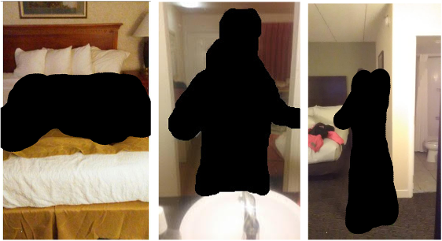
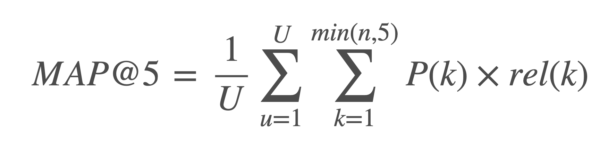

# Hotel Recognition to Combat Human Trafficking
    2021-04-05
    Edward Sims

## Introduction
Victims of human trafficking are often photographed in hotel rooms as in the below examples. Identifying these hotels is vital to these trafficking investigations but poses particular challenges due to low quality of images and uncommon camera angles.



Even without victims in the images, hotel identification in general is a challenging fine-grained visual recognition task with a huge number of classes and potentially high intraclass and low interclass variation. In order to support research into this challenging task and create image search tools for human trafficking investigators, we created the TraffickCam mobile application, which allows every day travelers to submit photos of their hotel room. Read more about [TraffickCam on TechCrunch](https://techcrunch.com/2016/06/25/traffickcam/).

## Evaluation
Submissions are evaluated according to the Mean Average Precision @ 5 (MAP@5):



where ***U*** is the number of images, ***P(k)*** is the precision at cutoff ***k***, ***n*** is the number of predictions per image, and ***rel(k)*** is an indicator function equaling 1 if the item at rank ***k*** is a relevant correct label, zero otherwise.

Once a correct label has been scored for an observation, that label is no longer considered relevant for that observation, and additional predictions of that label are skipped in the calculation. For example, if the correct label is ***A*** for an observation, the following predictions all score an average precision of 1.0.

```
A B C D E
A A A A A
A B A C A
```

## Submission File
For each image in the test set, you must predict a space-delimited list of hotel IDs that could match that image. The list should be sorted such that the first ID is considered the most relevant one and the last the least relevant one. The file should contain a header and have the following format:

```
image,hotel_id 
99e91ad5f2870678.jpg,36363 53586 18807 64314 60181
b5cc62ab665591a9.jpg,36363 53586 18807 64314 60181
d5664a972d5a644b.jpg,36363 53586 18807 64314 60181
```

## Data 
Identifying the location of a hotel room is a challenging problem of great interest for combating human trafficking. This competition provides a rich dataset of photos of hotel room interiors, without any people present, for this purpose.

Many of the hotels are independent or part of very small chains, where shared decor isn't a concern. However, the shared standards for their interior decoration for the larger chains means that many hotels can look quite similar at first glance. Identifying the chain can narrow the range of possibilities, but only down to a set that is much harder to tell apart and is still scattered across a wide geographic area. The real value lies in getting the number of candidates to a small enough number that a human investigator could follow up on all of them.

### Files
**train.csv** - The training set metadata.
 - `image` - The image ID.
 - `chain` - An ID code for the hotel chain. A chain of zero (0) indicates that the hotel is either not part of a chain or the chain is not known. This field is not available for the test set. The number of hotels per chain varies widely.
 - `hotel_id` - The hotel ID. The target class.
 - `timestamp` - When the image was taken. Provided for the training set only.
 
**sample_submission.csv** - A sample submission file in the correct format.
 - `image` The image ID
 - `hotel_id` The hotel ID. The target class.
 
**train_images** - The training set contains 97000+ images from around 7700 hotels from across the globe. All of the images for each hotel chain are in a dedicated subfolder for that chain.

**test_images** - The test set images. This competition has a hidden test set: only three images are provided here as samples while the remaining 13,000 images will be available to your notebook once it is submitted.
